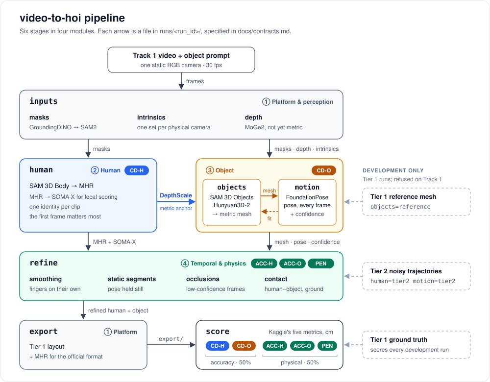

# video-to-hoi

Monocular 4D human–object reconstruction for Track 1 of the NVIDIA Video to Data (V2D) Challenge.

From one video taken by a single static RGB camera, and a text description of the object, the pipeline recovers the person (body and hands, as MHR parameters), the object's mesh, and the object's 6D pose in every frame, at metric scale in one world frame. It is scored against a multi-view reconstruction on five leaderboard metrics: human and object Chamfer distance (CD-H, CD-O), joint and object acceleration (ACC-H, ACC-O), and human–object penetration (PEN).



The human sets the metric scale that the object module uses (`DepthScale`). Mesh generation and tracking feed each other inside one module. Refine applies smoothing and contact to the human and the object together before export. Dashed inputs are Track 2 data, used only in Tier 1 development runs so that each module can start on its own.

## Modules

Four people build the pipeline in parallel, one module and one branch each. Every stage has a fake backend, so `main` runs end to end from day one and each module replaces its fakes with real models.

| Module | Stages | Metrics it moves | Branch | Module page |
|---|---|---|---|---|
| ① Platform & perception | inputs, export | all, as gatekeeper | `platform` | [Platform](https://claude.ai/artifact/A9hrz9B8qed9WWqkFWpAHg) |
| ② Human | human | CD-H | `human` | [Human](https://claude.ai/artifact/3jiAK6fqoNwqGtLwDKf3pk) |
| ③ Object | objects, motion | CD-O | `object` | [Object](https://claude.ai/artifact/35K4apKHN75wiUuB8qxmq8) |
| ④ Temporal & physics | refine | ACC-H, ACC-O, PEN | `physics` | [Physics](https://claude.ai/artifact/DUFpvGZmA2DyuU68afM7DV) |

Each module page is where its people keep their tasks, post progress and run results, and collect papers, code, models and data. The pages are shared on claude.ai; ask the repository owner for access.

- [docs/workflow.md](docs/workflow.md): why the modules are cut this way, how each one develops independently, and the merge gate.
- [docs/contracts.md](docs/contracts.md): the files the stages exchange.
- [docs/design.md](docs/design.md): the architecture, its evidence, and what is known about the official submission.

## Status

- **Scorer:** `python -m v2hoi.score` follows the organizer's Track 1 rules and reports the five leaderboard metrics in cm.
- **Pipeline:** `python -m v2hoi.run` runs all six stages with fake backends into the scorer. No reconstruction models are wired in yet.
- **Challenge:** the leaderboard freezes on 2026-11-04 at 17:00 EST.

## Setup

Requires Python 3.10+ and a CUDA build of PyTorch already installed. The venv below reuses the system torch instead of installing a CPU build:

```bash
uv venv .venv --python 3.10 --system-site-packages
uv pip install --python .venv/Scripts/python.exe numpy scipy pandas pyarrow trimesh huggingface_hub pytest warp-lang rtree cholespy usd-core
uv pip install --python .venv/Scripts/python.exe --no-deps "py-soma-x==0.2.1"
uv pip install --python .venv/Scripts/python.exe --no-deps -e .
```

On first use, `py-soma-x` downloads the SOMA-X assets from Hugging Face, pinned to the revision the official toolkit uses.

## Data

```bash
.venv/Scripts/python.exe -m v2hoi.download
```

Downloads into `data/v2d/`: Track 2 Tier 1 ground truth (human, object poses, meshes, ground planes), the Tier 2 noisy labels, and Track 1 metadata, about 400 MB. `--videos` also fetches the Tier 1 and Track 1 videos.

## Running the pipeline

```bash
.venv/Scripts/python.exe -m v2hoi.run --run-id demo --dataset tier1 --episodes 7 9 --score
```

Runs every stage on Tier 1 episodes 7 and 9 into `runs/demo/`, exports the result in the Tier 1 layout, and scores it. `--stages` runs only some stages, `--upstream runs/<run>` reads the other stages' outputs from an earlier run, and `--backend <stage>=<name>` picks a backend. `--dataset track1` runs on the challenge videos, which have no public ground truth.

## Scoring

A prediction root has the Tier 1 layout: `meta/info.json`, `meta/episodes_metadata.jsonl`, `data/chunk-000/episode_XXXXXX.parquet` (Tier 1 columns), and `mesh/<object>/<object>.glb`.

```bash
.venv/Scripts/python.exe -m v2hoi.score --pred <prediction root>
```

The first five columns of the table are the Track 1 leaderboard metrics in cm, as on Kaggle; the rest are diagnostics. Below the table is the internal score, which puts the five metrics on one scale where Tier 2 scores 1 (see `docs/workflow.md`). Then the scorer says whether the run used the official settings and whether the prediction is a valid submission, with the reasons if not. The full report is written to `scores/`.

Options:
- `--episodes 7 9` scores a subset; by default every episode is required.
- `--stride 3` evaluates the per-frame mesh metrics on every third frame.
- `--align first|first-object|se3|sim3|none` picks the alignment. The default, `first`, is the official rule: one Sim(3) on the first frame's body joints. `first-object` is for tracking work with the reference mesh.
- `--pred-mesh-dir` looks for prediction meshes elsewhere.
- `--summary <file>` also writes the compact summary kept in `benchmarks/`.
- `--strict` exits with status 1 unless the settings are official and the submission is valid. Run it before submitting to Kaggle.

What the official submission is, and which rules the scorer enforces: `docs/design.md`, sections 6 and 5.1.

Two self-checks:

```bash
.venv/Scripts/python.exe -m v2hoi.score --pred data/v2d/track_2/tier_1_multiview_caption
```

```bash
.venv/Scripts/python.exe -m v2hoi.score --pred data/v2d/track_2/tier_2_synthetic_noise --pred-mesh-dir data/v2d/track_2/tier_1_multiview_caption/mesh
```

The first scores the ground truth against itself, so every error should be close to 0. The second scores the organizer's Tier 2 labels, noise sampled from Track 1 error distributions, as a reference. Both are reported as invalid submissions because their meshes are the reference meshes. Metric definitions: `docs/design.md`, section 5.

## Tests

```bash
.venv/Scripts/python.exe -m pytest
```
