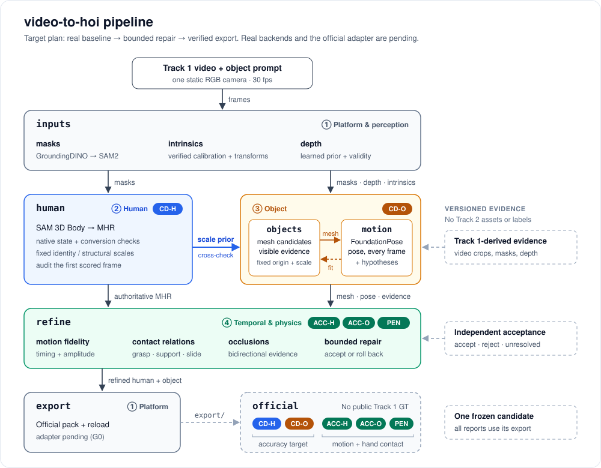

# video-to-hoi

Monocular 4D human–object reconstruction for Track 1 of the NVIDIA Video to Data (V2D) Challenge.

## Prepare a server handoff

Start with [deployment/README.md](deployment/README.md) for the source ZIP, pinned model/source inventory, dependency locks, and download/verification commands. This preparation works without SSH. Git holds code, manifests, and instructions; large pretrained weights and Python wheels are separate transfer artifacts. All 12 required model entries are downloaded and verified. See [deployment/PREPARATION_STATUS.md](deployment/PREPARATION_STATUS.md) for the handoff scope. Server deployment is deferred at the owner's request; the two real baselines remain pending.

**Project status (in Chinese), for leadership and product updates: [open the status page](https://claude.ai/artifact/U2vgULC1h3DurtZwyQRHS1)** · source: [docs/status.html](docs/status.html) · how to update it: [docs/status.md](docs/status.md)

**Published download:** [FoundationPose add-on (239 MB), SHA-256, and metadata](https://github.com/Seanwilliam2077/video-to-hoi/releases/tag/foundationpose-addon-20260927). Extract the existing public-assets handoff first, then overlay this add-on. This release contains the two FoundationPose model folders and code snapshot `5205666`; the base archive and host wheelhouse remain separate handoff files.

**New model download:** [CARI4D, SAM3D Body, and SAM3D Objects (18 GB / 11 parts)](https://github.com/Seanwilliam2077/video-to-hoi/releases/tag/hf-models-20260927). The release includes a manifest, SHA-256 checks, restore script, and model license notice. Follow [download and restore instructions](deployment/MODEL_RELEASES.md), then extract all three reconstructed ZIPs into the same handoff directory. GitHub's Source code ZIP does not contain model weights.

## First-three-video comparison kit

[Benchmark instructions and candidate readiness](benchmarks/first3/README.md) cover Track 1 episodes 0, 1, 2 (2,324 frames), five execution recipes, and internal per-metric ranking with missing/fairness checks. The remote entry point is not yet available: no models were run, no scores or winners are reported, and MHR adapters for the temporal research candidates remain pending.

## Team pages

| Page | What it holds |
|---|---|
| **[Track 1 reference](https://claude.ai/artifact/YXL887jxTTp7aQByCQvC6b)** | Challenge rules and scoring, the 30 Track 1 videos, and our questions to the organizer |
| [① Platform & perception](https://claude.ai/artifact/A9hrz9B8qed9WWqkFWpAHg) | Module 1: tasks, progress and run results, reading list |
| [② Human](https://claude.ai/artifact/3jiAK6fqoNwqGtLwDKf3pk) | Module 2: tasks, progress and run results, reading list |
| [③ Object](https://claude.ai/artifact/35K4apKHN75wiUuB8qxmq8) | Module 3: tasks, progress and run results, reading list |
| [④ Temporal & physics](https://claude.ai/artifact/DUFpvGZmA2DyuU68afM7DV) | Module 4: tasks, progress and run results, reading list |

The pages live on claude.ai and are shared with the team. Post progress and run results on your module's page, and record every answer from the organizer on the reference page.

## Data policy

**Use Track 1 only.** Track 2 data, including Tier 1 and Tier 2, must not be used for this project's reconstruction, development, parameter tuning, validation, scorer self-checks, baseline normalization, or submissions. This includes videos, meshes, human/object trajectories, labels, and camera, scale, or tuning parameters derived from them.

Develop against Track 1 videos and artifacts reconstructed from those videos. Use independently generated synthetic geometry and trajectories for unit tests; do not derive fixtures or noise distributions from Track 2. Older team pages or code paths that suggest Track 2 use are superseded by this policy. See [docs/workflow.md](docs/workflow.md).

## Overview

From one video taken by a single static RGB camera, and a text description of the object, the pipeline recovers the person (body and hands, as MHR parameters), the object's mesh, and the object's 6D pose in every frame, at metric scale in one world frame. It is scored against a multi-view reconstruction on five leaderboard metrics: human and object Chamfer distance (CD-H, CD-O), joint and object acceleration (ACC-H, ACC-O), and human–object penetration (PEN).



The human sets the metric scale that the object module uses (`DepthScale`). Mesh generation and tracking feed each other inside one module. Refine applies smoothing and contact to the human and the object together before export. Modules develop against fixed snapshots reconstructed from Track 1, with independent synthetic fixtures for interface tests.

## Modules

Four people build the pipeline in parallel, one module and one branch each. Every stage has a fake backend, so `main` runs end to end from day one and each module replaces its fakes with real models.

| Module | Stages | Metrics it moves | Branch |
|---|---|---|---|
| ① Platform & perception | inputs, export | all, as gatekeeper | `platform` |
| ② Human | human | CD-H | `human` |
| ③ Object | objects, motion | CD-O | `object` |
| ④ Temporal & physics | refine | ACC-H, ACC-O, PEN | `physics` |

- [docs/workflow.md](docs/workflow.md): why the modules are cut this way, how each one develops independently, and the merge gate.
- [docs/contracts.md](docs/contracts.md): the files the stages exchange.
- [docs/design.md](docs/design.md): the architecture, its evidence, and what is known about the official submission.
- [docs/platform.md](docs/platform.md): remote machine sizing, the candidate Blackwell host, and baseline acceptance requirements. Remote deployment and the two real baselines are still pending.

## Track 1 videos

[docs/track1-videos/index.html](docs/track1-videos/index.html) previews all 30 Track 1 videos, filterable by object and camera. GitHub shows its source, so open it from a clone. `python tools/track1_gallery/build.py` rebuilds it from the downloaded videos.

## Status

- **Validation:** Track 1 has no public ground truth. Local review uses reprojection, trajectory completeness, smoothness, and visual inspection; the five official scores require the organizer's evaluation. Automated Track 1 diagnostic reports are still to be implemented.
- **Legacy scorer:** `v2hoi.score` contains metric primitives, but its default reference and internal score depend on Track 2. Its existing command-line workflow is outside the approved project workflow.
- **Pipeline:** `python -m v2hoi.run` runs all six stages with fake backends through export. No reconstruction models are wired in yet.
- **Challenge:** the leaderboard freezes on 2026-11-04 at 17:00 EST.

## Setup

Requires Python 3.10+ and a CUDA build of PyTorch already installed. The venv below reuses the system torch instead of installing a CPU build:

```bash
uv venv .venv --python 3.10 --system-site-packages
uv pip install --python .venv/Scripts/python.exe numpy scipy pandas pyarrow trimesh huggingface_hub pytest warp-lang rtree cholespy usd-core
uv pip install --python .venv/Scripts/python.exe --no-deps "py-soma-x==0.2.1"
uv pip install --python .venv/Scripts/python.exe --no-deps -e .
```

On first use, `py-soma-x` downloads the SOMA-X assets from Hugging Face, pinned to the revision the official toolkit uses.

## Data

Download only the Track 1 subtree, including its videos:

```bash
.venv/Scripts/python.exe -c "from huggingface_hub import snapshot_download; snapshot_download(repo_id='nvidia/video_to_data_challenge', repo_type='dataset', local_dir='data/v2d', allow_patterns=['track_1/**'])"
```

This writes to `data/v2d/track_1/`. The current `v2hoi.download --videos` implementation is also restricted to Track 1 and accepts `--revision` to pin the dataset snapshot; this change is awaiting remote runtime verification. Neither command removes data already on disk. Existing Track 2 files and derived artifacts must stay out of project runs and baselines.

## Running the pipeline

```bash
.venv/Scripts/python.exe -m v2hoi.run --run-id track1-smoke --dataset track1 --episodes 16 12
```

Runs every stage on Track 1 episodes 16 and 12 into `runs/track1-smoke/` and exports the result in the internal schema. The current fake outputs test the interfaces, not reconstruction quality. `--stages` runs only some stages, `--upstream runs/<run>` reads outputs reconstructed from Track 1 in a fixed earlier run, and `--backend <stage>=<name>` picks an implemented backend.

The runner now defaults to and accepts only `track1`; keep `--dataset track1` explicit in shared commands. It rejects `--score`, `human=tier2`, `motion=tier2`, and `objects=reference`. These code changes await remote runtime verification. The default exporter is still named `tier1`; this is a serializer name only and does not read Track 2 data.

## Validation and official scoring

The internal export contains `meta/info.json`, `meta/episodes_metadata.jsonl`, `data/chunk-000/episode_XXXXXX.parquet`, `mesh/<object>/<object>.glb`, and the corresponding MHR files. This storage schema does not authorize using another dataset's assets.

Review a fixed Track 1 subset (`0 6 9 16 24`) for every stage change and all 30 episodes for integration. Check all-frame coverage, reprojection against the input video, shared object scale, human-object contact, smoothness, and failure cases. Model-estimated depth, masks, and these diagnostics are not ground truth or official leaderboard scores. Keep the run manifest, before/after visuals, and measurements in the PR; the comparison tooling is planned in [docs/workflow.md](docs/workflow.md).

The old Track 2 self-check commands and the Tier 2-normalized internal score are retired. `v2hoi.score --strict` is not the Track 1 submission gate: it uses the legacy reference-based workflow and cannot certify the data source or the official format. The organizer evaluates CD-H, CD-O, ACC-H, ACC-O, and PEN; adapt export to the official evaluation script once its format is available. Known rules and remaining assumptions are in [docs/design.md](docs/design.md), sections 5 and 6.

## Tests

CI runs this explicit list of independent synthetic tests, including the download/bundle tools and fake-stage wiring:

```bash
python -m pytest -q tests/test_bundle.py tests/test_contracts.py tests/test_dataset.py tests/test_fetch_assets.py tests/test_download_foundationpose.py tests/test_model_release_prepare.py tests/test_model_release_restore.py tests/test_benchmark_first3.py tests/test_rank_first3.py tests/test_geometry.py tests/test_metrics.py tests/test_run.py
```

These files create their own synthetic fixtures. `test_run.py` uses generated metadata and never invokes the legacy scorer. Do not run a bare `pytest`: `test_score.py` still contains Tier 2-derived benchmark assertions and can read Track 2 files when present, so CI excludes it. Passing these tests verifies the covered contracts and wiring, not real model quality, complete data provenance, or the official submission format.
